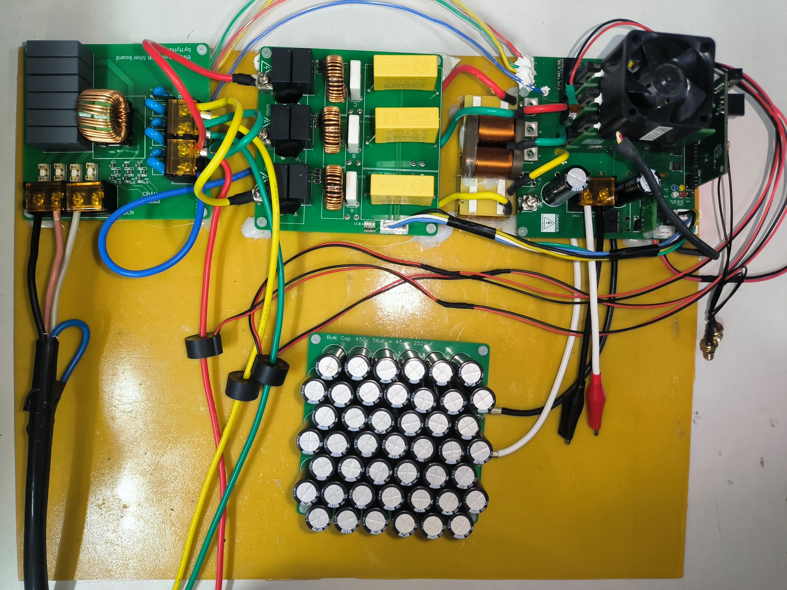
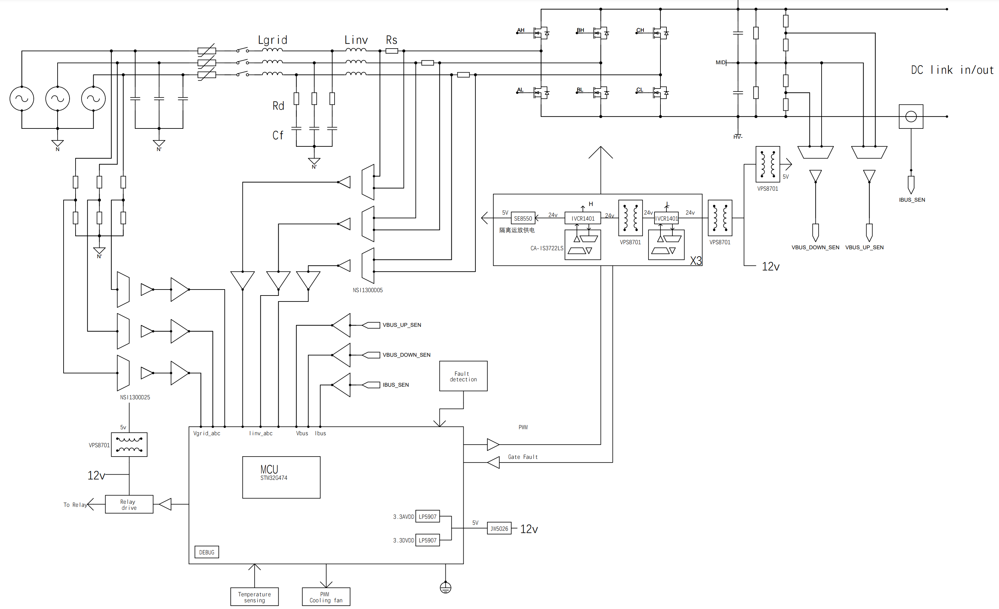
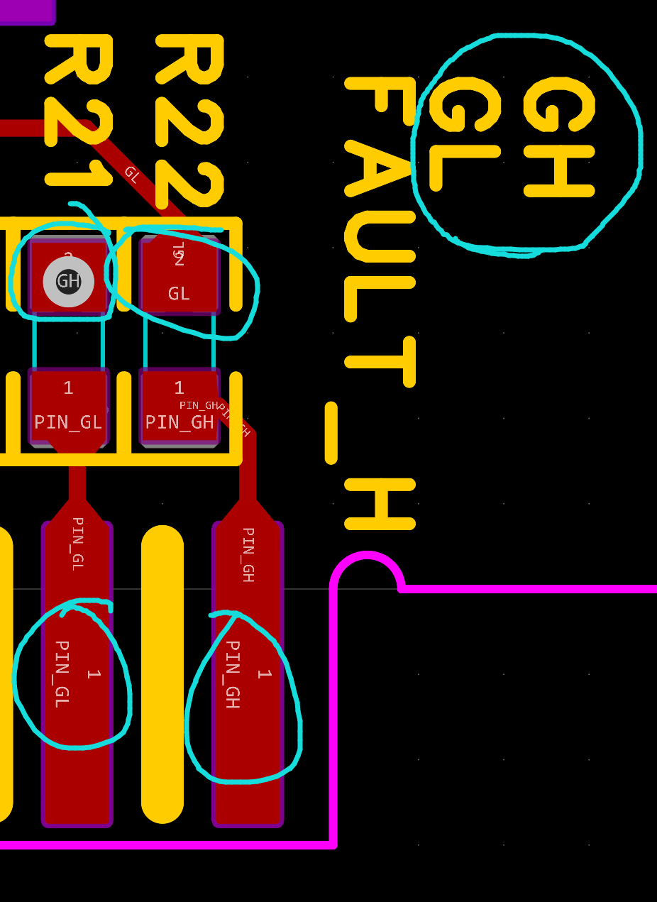
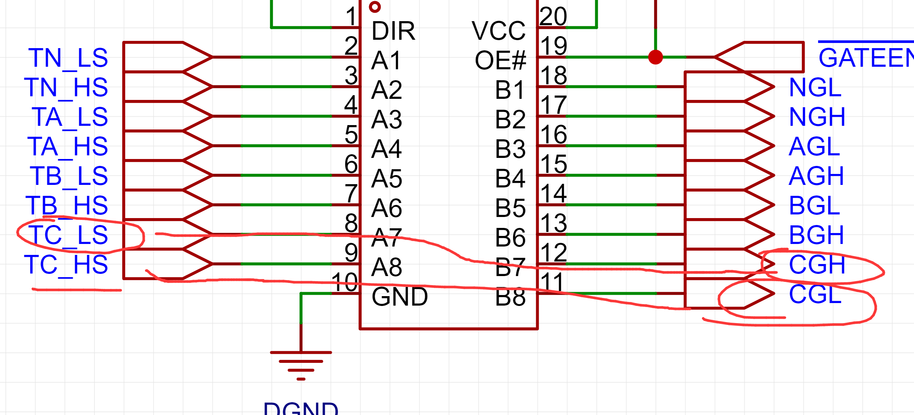

# 三相双向SiC无桥图腾柱逆变器/PFC实验平台

​	

​	该项目是一个全功能的三相/单相双向交直流（AC-DC）实验平台，旨在为学习者和研究者提供一个可靠且易于操作的环境，用于研究和实验正向功率因数校正（PFC）操作以及反向逆变设备。
​	实验平台设备的设计着眼于为用户提供一套包括所有必要硬件和软件功能的完整解决方案，以支持在实际环境中进行电力电子设备的学习和实验。这套设备采用了三相AC-DC配置，是电力系统和电力电子领域常见的系统结构，可以模拟现实中数据中心电源前级，双向车载充电器，逆变器，SVG/APF，大功率无刷电机驱动器等。
​	正向PFC操作的学习和实验是此实验平台的主要功能之一。功率因数校正是电力电子中的重要概念，通过控制输入电流的相位和幅值与输入电压同步，可以最大化设备的效率，降低能源损耗。
​	另一方面，实验平台还支持反向逆变设备的学习和实验。逆变器是将直流电源转换为交流电源的设备，在电力系统中有广泛应用，例如太阳能光伏发电、电动汽车逆变等。
​	在器件选型上，在元器件选择方面，本设计尽可能选择国产器件，这些器件不仅有稳定的采购渠道，而且价格相对较低，经过实验性能也足够稳定可靠，能够满足实验需求。

# **警告**

1. 本设计仅适用于实验室环境，并不能作为最终成品供普通消费者使用。
2. 本设计仅限于具备高压电子和机械部件操作经验，能够妥善应对相关风险的专业工程师和技术人员使用。
3. 注意！电路板内部含有**高电压**部分。若处理不慎或误操作，可能引发电击、火灾或人身伤害。在使用本设备时，必须保持高度警惕，并采取相应的防护措施，以预防可能发生的人身伤害或财产损失。
4. 严禁在无人监管的情况下对本设计进行通电操作。
5. 为保障安全，强烈建议使用配备过压和过流保护功能的隔离测试设备。在给电路板供电或进行仿真前，用户有义务确保已**充分理解并掌握电压和隔离要求**。**供电后，请严禁触摸本设计或任何与之连接的元件**。
6. 警告：**表面可能高温！**触摸可能造成烫伤。请勿触摸！电路板通电后，部分元件可能升温至55°C以上。在运行期间或刚刚结束运行时，用户应避免触摸电路板，因其表面可能存在高温危险。
7. **设计为110v系统设计，严禁使用超过额定电压的进行供电**

## 关于硬件

### 控制板

​	先焊接芯片，确保无短路，然后焊接LDO，时钟电路等，确保晶振波形正常，烧录代码后，Vref引脚处有内置的2900mv基准输出。

### 半桥板

低压场景MOSFET并联的栅极电容空焊，退保和检测，米勒钳位电路建议焊接。焊接完先上12v电，电流不超过100ma，隔离电源输出正常后电压提升至24v。测量各点电压是否正常。

使用SIC驱动需要24V，原理图标注的12V是错误的。

**注意，这一版 开关半桥的GH GL 标注丝印是反的，请注意飞线修正**

**强烈建议在系统上电前按照调试过程测试相关信号！**

### 底板

焊接DCDC电路和AVDD和DVDD的LDO，供电12v，测量电压

焊接信号调理运放，TL432偏压基准(请修改分压电阻，原理图不准确) 1450mv，测量各点电压是否正常。

焊接隔离供电，测量隔离供电电压输出是否正常。

最后焊接五颗隔离运放，上电，整板电流不应超过150ma，隔离运放微微发热，

**注意：**在0输入条件下，由于隔离运放输入偏置电流影响高阻抗的分压电阻网络，导致输出电压整体有个向上的偏移约几百mv，这个偏移会导致母线电压检测的范围不是对称的，这个是BUG，后期应该更换方案重新设计。检测电流的隔离运放无这个问题。后续软件程序中应该校准这一直流偏移。

**注意，这一版 底板电路C相的PWM驱动信号CH CL 是反的，请注意飞线修正！**

### LCL滤波器及继电器

注意安全间距即可，继电器一颗电流约50ma

最后实物使用的LCL滤波器参数可能与设计参数不一样，最后参数为：

网侧电感：080-125 铁硅铝磁环 1.0线径 10A100uH

滤波器电容：X2安规电容 275V 2.2uF 优信电子

滤波器电感：华为3kW通信电源拆机扁平线电感。500uH，饱和电流未知，估测15A？。

以上参数仅供参考！请自行计算并修改。

## 关于软件

​	系统具有输入过流检测，输出过压、过流检测。其保护功能使用控制器内部硬件关断锁闭PWM波，不保证任何情况下都能稳定触发保护，具体保护设计请参考设计文档。

虽然采样电路已经是全隔离，但是仍然**强烈不建议在系统运行时靠近此或触摸系统任一裸露部位**！在任何情况下都**不允许使用非隔离方式进行测量高压侧的元器件**！

​	**一定要使用低压DC电源，进行开环逆变以修正硬件上栅极驱动信号画反的BUG！**

​	**一定要使用低压DC电源，进行开环逆变以修正硬件上栅极驱动信号画反的BUG！**

​	**一定要使用低压DC电源，进行开环逆变以修正硬件上栅极驱动信号画反的BUG！**

​	具体软件调试方式请参考

https://www.ti.com.cn/tool/cn/TIDA-01606

​	

​	软件基于keil+stm32cubemx+LL库设计。

下载完解压后不能直接编译下载运行，请编译后按照警告/错误来修改系统参数！

### 关于中断

​	本设计提供的代码和TIDA-01606具有一定的异同点，除了和MCU寄存器操控不同的地方外，一个比较重要的点是控制ISR触发方式为：HRTIM特定时刻触发ADC采样->在ADC1所有注入组转换完成后触发中断，在中断内执行环路控制代码。本工程使用了PA6来检测控制中断中的执行频率和时间，高电平为中断响应过程，在LAB7中，中断CPU时间约为75%。默认执行与PWM同频，为42525Hz。

​	使用STM32cubeMX重新生成代码之后需要注意，Core\Src\stm32g4xx_it中使用CCMRAM的控制宏会被覆盖掉，请确保一下中断是被正确修饰的，特别是 ADC1_2_IRQHandler这一ISR中，这个ISR运行了中断控制代码。

ADC1_2_IRQHandler

HRTIM1_FLT_IRQHandler

SysTick_Handler

ADC4_IRQHandler

DMA2_Channel5_IRQHandler

默认PWM映射为：

#define PFC_PHASE_A_TIMER LL_HRTIM_TIMER_F
#define PFC_PHASE_B_TIMER LL_HRTIM_TIMER_E
#define PFC_PHASE_C_TIMER LL_HRTIM_TIMER_A
#define PFC_PHASE_N_TIMER LL_HRTIM_TIMER_B

### 默认采样触发设置

​	默认ADC映射为：

相电流和母线电流采集——ADC1

相电流：ADC_Injected_ConversionMode  触发源： HRTIM ADC trigger 2 event  ，一次触发转换所有规则组，采样周期6.5个时钟周期。

A相电流——PA0——注入组RANK1

B相电流——PA1——注入组RANK2

C相电流——PA2——注入组RANK3

母线电流：ADC_Regular_ConversionMode  触发源： HRTIM ADC trigger 3  event，扫描转换模式，使能4倍超采样，使用DMA1 CH1搬运结果到内存中，采样周期12.5个时钟周期

母线电流——PA3——规则组RANK1 

电网和母线电压采集->ADC2

相电压：ADC_Injected_ConversionMode  触发源： HRTIM ADC trigger 2 event  ，一次触发转换所有规则组，采样周期6.5个时钟周期。

A相电流——PC0——注入组RANK1

B相电流——PC1——注入组RANK2

C相电流——PC2——注入组RANK3

母线电压：ADC_Regular_ConversionMode  触发源： HRTIM ADC trigger 3  event，扫描转换模式，使能4倍超采样，2bit位移，使用DMA1 CH2搬运结果到内存中，采样周期12.5个时钟周期

高侧电容电压——PA7——规则组RANK1 

低侧电容电压——PA4——规则组RANK2 

温度和内部参考电压采集 ADC4

ADC_Injected_ConversionMode  触发源： 软件触发 ，一次触发转换所有规则组，使能16倍超采样，4bit位移，采样周期640.5个时钟周期。

### fault 路径

  //  OC_AC   -->   FAULT 1
  //  GATE_F  -->   FAULT 2
  //  OV_DC   -->   FAULT 3
  //  OC_DC   -->   FAULT 4

## 其他

由于本人精力有限，本硬件设计稿为第一版，遇到的BUG可能不能一一详尽描述，也暂时没有时间和精力修正bug之后再重新打板验证。

本设计软硬件参考了TI/ST软硬件设计，库的版权说明请参考其官网说明，**本设计仅可用于学习用途，严禁商用！**

设计文档中的计算公式并未详细考究。仅供参考。

室温27度条件下，750W运行十分钟情况下系统温度应不超过60度，